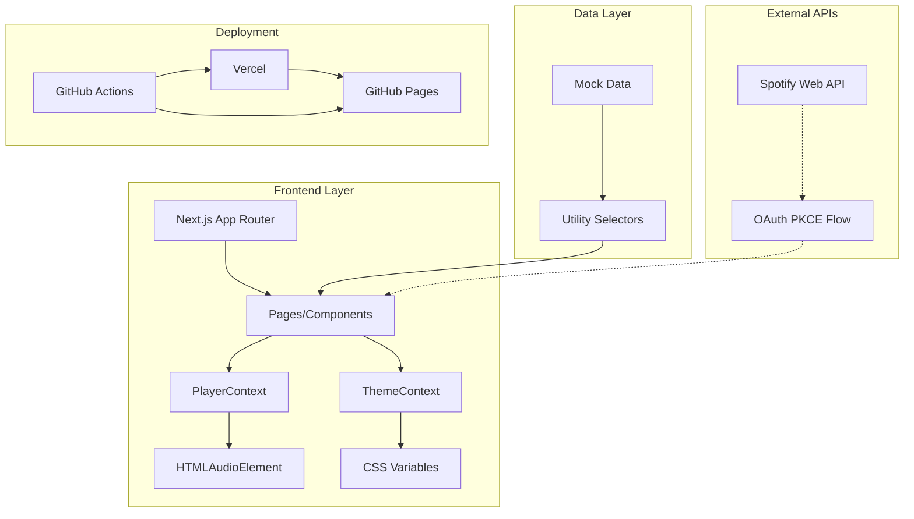

# Architecture Overview

## System Architecture



## Data Flow

### 1. User Interaction Flow
```
User Action → Component → Context → State Update → UI Re-render
```

### 2. Music Playback Flow
```
Track Selection → PlayerContext → HTMLAudioElement → Audio Output
```

### 3. Theme Management Flow
```
Theme Toggle → ThemeContext → CSS Variables → UI Update
```

## Component Hierarchy

```
app/
├── layout.tsx (Root Layout)
├── page.tsx (Home Page)
├── search/page.tsx
├── profile/page.tsx
├── album/[id]/page.tsx
└── playlist/[id]/page.tsx

components/
├── Layout.tsx
├── Header.tsx
├── Sidebar.tsx
├── Playbar.tsx
├── Card.tsx
├── PlaylistItem.tsx
├── FeaturedSection.tsx
├── ContentGrid.tsx
└── MadeForYou.tsx

context/
├── PlayerContext.tsx (Audio State Management)
└── ThemeContext.tsx (Theme State Management)

data/
└── mockData.ts (Mock Data & Selectors)

types/
└── index.ts (TypeScript Definitions)
```

## Key Design Patterns

### 1. Context Pattern
- **PlayerContext**: Manages global audio state
- **ThemeContext**: Manages theme preferences
- Both use React Context API for state management

### 2. Custom Hooks
- **usePlayer()**: Access player state and actions
- **useTheme()**: Access theme state and toggle function

### 3. Component Composition
- Layout components wrap page content
- Reusable components (Card, PlaylistItem) for consistency
- Styled Components for CSS-in-JS

### 4. Type Safety
- Comprehensive TypeScript interfaces
- Strict type checking throughout
- Generic types for reusable components

## State Management

### Player State
```typescript
interface PlayerState {
  currentTrack: Track | null;
  isPlaying: boolean;
  currentTime: number;
  duration: number;
  volume: number;
  queue: Track[];
  queueIndex: number;
  repeat: 'off' | 'track' | 'context';
  shuffle: boolean;
}
```

### Theme State
```typescript
interface Theme {
  colors: { primary, secondary, background, ... };
  spacing: { xs, sm, md, lg, xl };
  borderRadius: { sm, md, lg };
  shadows: { sm, md, lg };
}
```

## Performance Optimizations

### 1. Next.js Optimizations
- App Router for better performance
- Automatic code splitting
- Image optimization
- Static generation where possible

### 2. React Optimizations
- useCallback for stable function references
- useMemo for expensive calculations
- Proper dependency arrays in useEffect

### 3. Audio Optimizations
- Single HTMLAudioElement instance
- Event listener cleanup
- Lazy loading of audio resources

## Accessibility Features

### 1. Keyboard Navigation
- Tab navigation through all interactive elements
- Arrow keys for audio control
- Space bar for play/pause
- Enter/Space for button activation

### 2. ARIA Labels
- Descriptive labels for all interactive elements
- Screen reader friendly content
- Focus management

### 3. Visual Indicators
- Focus outlines for keyboard navigation
- High contrast mode support
- Reduced motion preferences

## Testing Strategy

### 1. Unit Tests
- Component rendering tests
- Context state management tests
- Utility function tests

### 2. Integration Tests
- Page-level component tests
- User interaction flows
- API integration tests

### 3. E2E Tests (Future)
- Complete user journeys
- Cross-browser testing
- Performance testing

## Deployment Architecture

### 1. Vercel (Primary)
- Automatic deployments from GitHub
- Edge functions for API routes
- Global CDN distribution
- Preview deployments for PRs

### 2. GitHub Pages (Backup)
- Static site generation
- GitHub Actions for deployment
- Custom domain support

### 3. CI/CD Pipeline
- Automated testing on every push
- Linting and type checking
- Build verification
- Deployment to staging/production

## Security Considerations

### 1. Client-Side Security
- Input sanitization
- XSS prevention
- CSRF protection

### 2. API Security (Future)
- OAuth 2.0 with PKCE
- Token refresh handling
- Rate limiting
- CORS configuration

## Scalability Considerations

### 1. Code Organization
- Modular component structure
- Reusable utility functions
- Clear separation of concerns

### 2. Performance
- Lazy loading of routes
- Image optimization
- Bundle size optimization

### 3. State Management
- Context splitting for better performance
- Local state vs global state decisions
- Memory leak prevention

## Future Enhancements

### 1. Real API Integration
- Spotify Web API integration
- OAuth authentication flow
- Real-time data synchronization

### 2. Advanced Features
- Offline support with Service Workers
- Push notifications
- Social features (sharing, following)

### 3. Performance
- Virtual scrolling for large lists
- Audio visualization
- Advanced caching strategies
